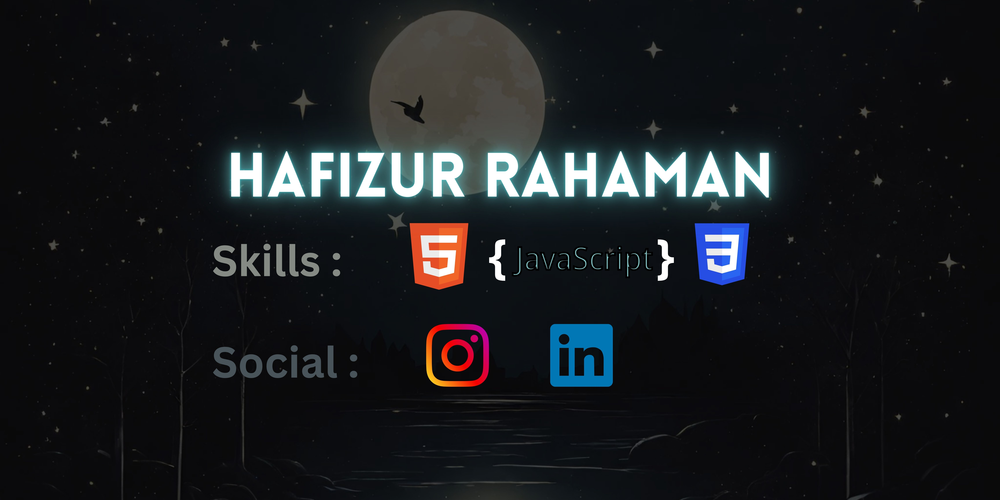

  

<h3 align="center">
Hi there, I'm <a href="https://twitter.com/hafizurrahaman0" target="_blank" rel="noreferrer">Hafizur Rahaman</a> 👋
</h3>

Hi, I’m Hafizur Rahaman, a student who is passionate about web development. I enjoy learning new things and challenge myself with the new topic what I've learnt.
If you want to collaborate with me on some project you can contact me from the given link below

## 🔗 Links

## 🔭 I'm currently working on

- My old projects on frontendmentor
- JavaScript
- Basic React App

## 🌱 I'm currently learning

- JavaScript
- ReactJS

## 📈 GitHub Stats 

